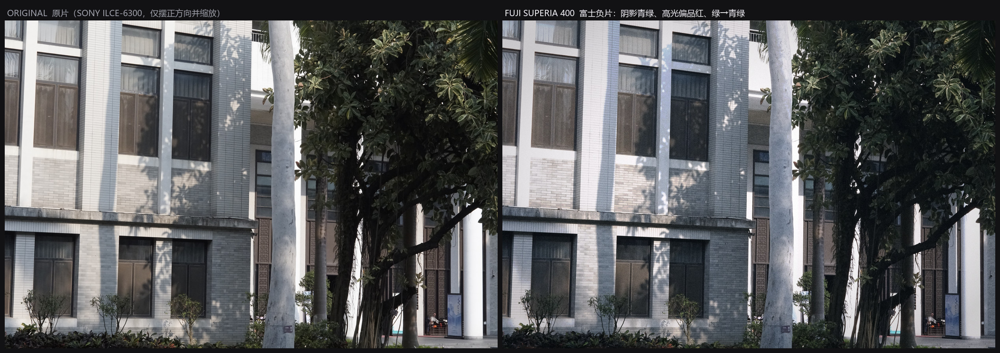
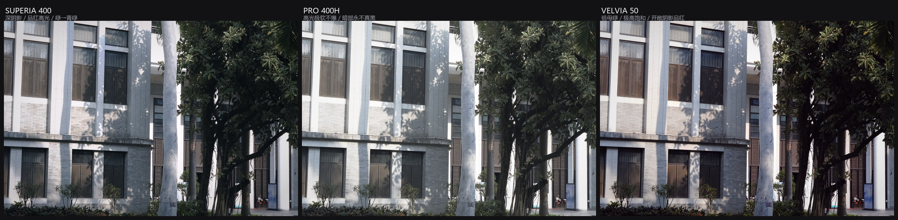
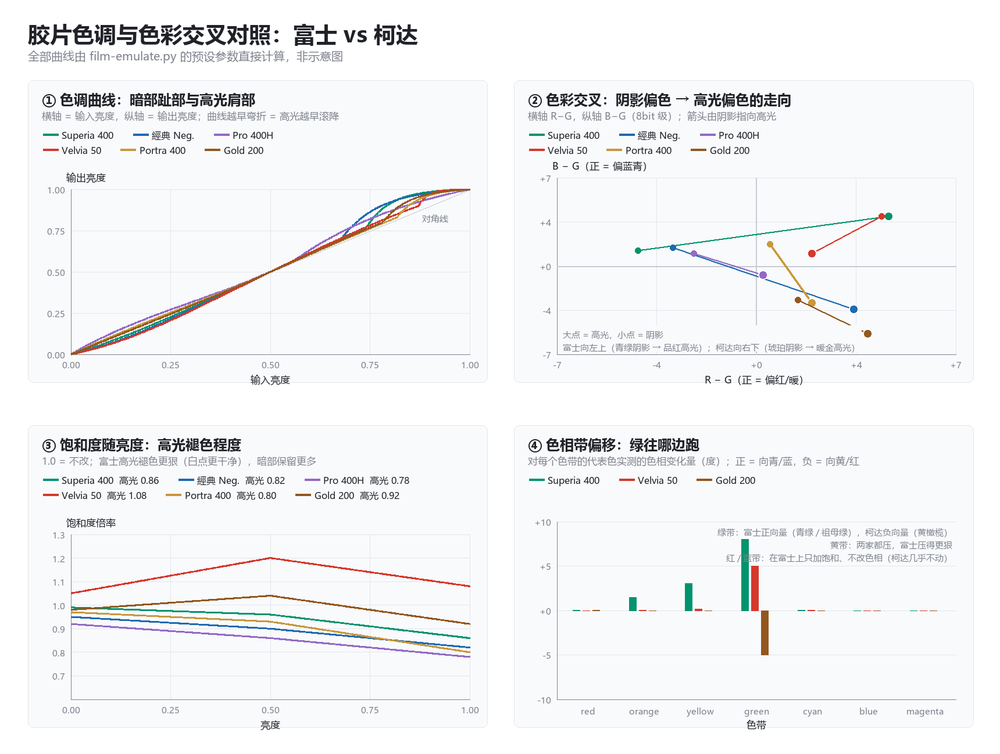
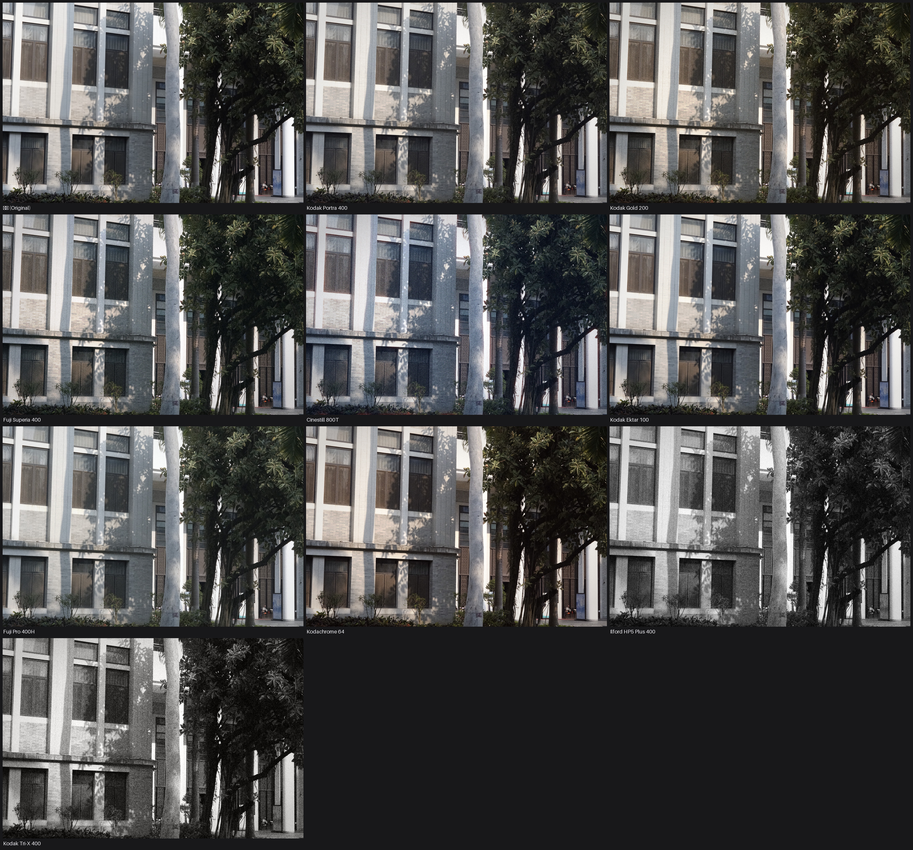
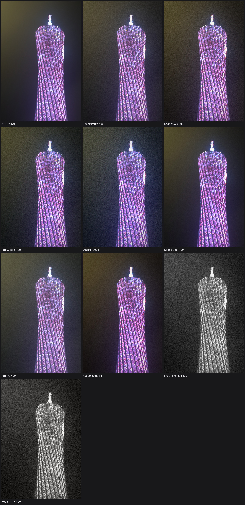
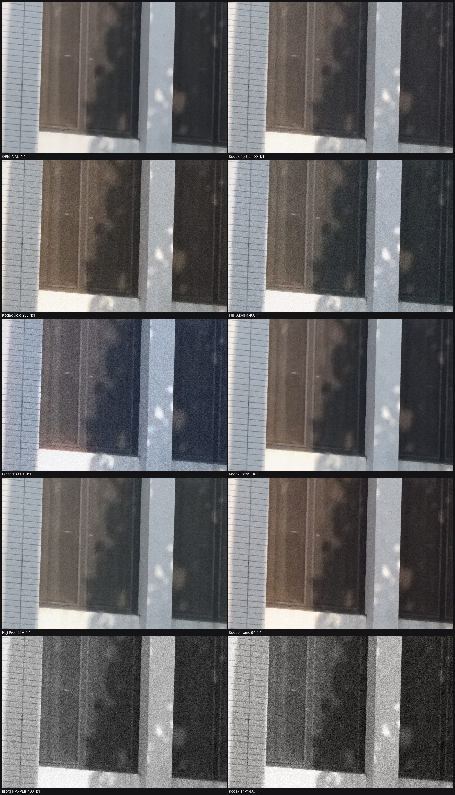
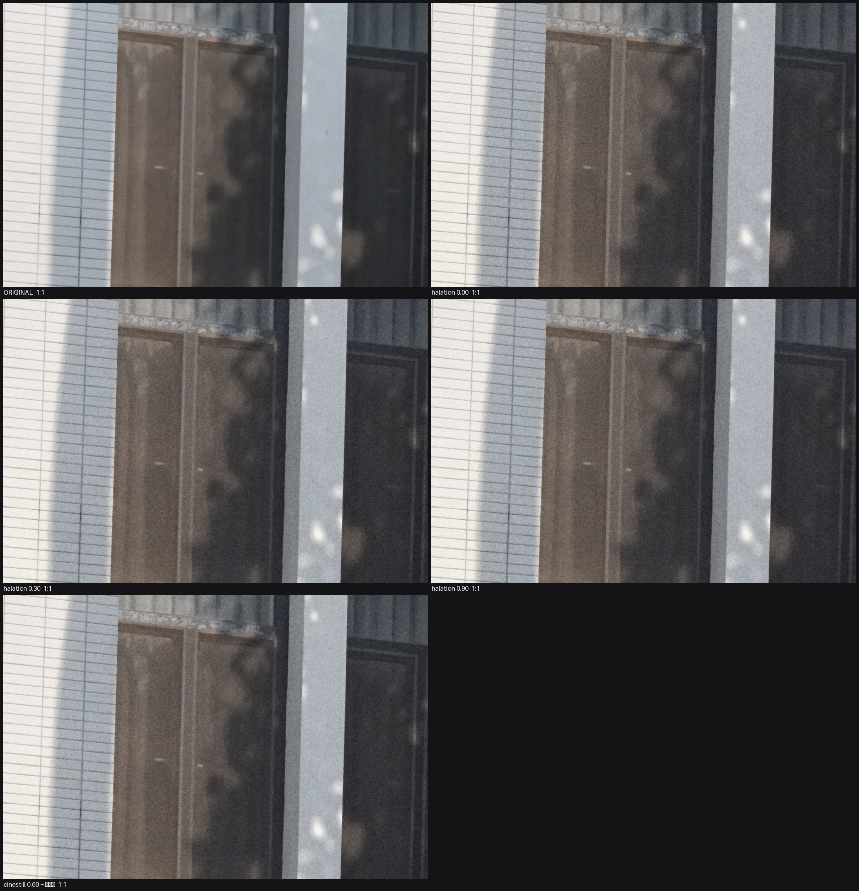

# film-emulation-batch

把一整个目录的照片批量套成胶片风格。**纯本地、离线、零 API、不依赖 Lightroom / Photoshop**，参数全部可读可改，固定种子下结果逐像素可复现。



左：原片（SONY ILCE-6300 实拍，仅摆正方向并缩放到同宽）。右：本项目 `superia400` 预设的输出。**颗粒与光晕在缩略图上看不出来**，1:1 证据见 [`grain-and-tone-1to1.jpg`](images/grain-and-tone-1to1.jpg) 与 [`halation-grading-1to1.jpg`](images/halation-grading-1to1.jpg)。

> EN: Batch film-emulation color grading in pure Pillow + NumPy. 17 presets (Fuji / Kodak / B&W), per-channel curve LUTs, selective hue-band rotation (greens → teal), channel crossover, grain, halation, vignette, acutance, external `.cube` 3D LUT support. Deterministic, offline, no API cost.

---

## 这是什么，不是什么

| | |
|---|---|
| **是** | 显示空间里的胶片风格复现：每通道曲线 LUT + 通道色偏（crossover）+ **色相带选择性调整** + 颗粒 + 高光溢出（halation）+ 暗角 + acutance |
| **是** | 17 款预设，全部参数显式写在 `PRESETS` 里，可改、可覆盖、可复现；支持外部 `.cube` 3D LUT |
| **不是** | 物理仿真。没有光谱感光曲线，颗粒也不是乳剂团簇模型（见 [已知局限](#已知局限)） |
| **不是** | AI 重绘或生成。不改画面内容，不"补"不存在的细节，输出像素级可校对 |

**为什么不用 Lightroom 预设**：因为要批量、要可复现、要能读代码里每一行的数值。`--seed 20260926` 固定后，同一张输入两次跑出的文件逐像素一致。

---

## 快速开始

```bash
git clone https://github.com/boway033-cell/film-emulation-batch.git
cd film-emulation-batch
pip install pillow numpy

# 1) 看有哪些预设
python scripts/film_emulate.py --list

# 2) 先出一张对比图，再决定跑哪个预设
python scripts/film_emulate.py --sheet samples/sample-building.jpg -o ./preview --group fuji --max-edge 1050

# 3) 批量跑一个目录
python scripts/film_emulate.py -i ./photos -p superia400 -o ./out --jobs 6

# 4) 一次跑完整个家族（输出到 <out>/<preset>/）
python scripts/film_emulate.py -i ./photos --group fuji -o ./out --jobs 6

# 5) 单张微调，不改预设文件
python scripts/film_emulate.py -i a.jpg -p superia400 --grain 1.6 --halation 0.6 --vignette 0 --exposure 0.3 \
        --temp -0.2 --tint 0.1 --acutance 0.2

# 6) 套外部 3D LUT（与预设曲线叠加）
python scripts/film_emulate.py -i ./photos -p neutral --lut ./LUTs/Kodak2383.cube --lut-strength 0.8
```

**实测**：24MP 输入、6 进程，单张约 12s；39 张连拍 Portra 400 全批 76.5s，Superia 400 138.7s（预设越复杂越慢）。CPU-only，不需要显卡。

---

## 预设一览（17 款）



### 富士 FUJI（`--group fuji`）

| 预设 | 风格 | 适合 |
|---|---|---|
| `superia400` | 深阴影偏青绿、高光偏品红、绿→青绿、黄被压、白点偏冷 | 万能：街拍、植物、夜景 |
| `classic_neg` | 暗部硬调、明暗区色调分离、高光转暖、饱和被抑制 | 纪实、速写感 |
| `c200` | 冷而准、不变黄 | 日光日常 |
| `pro400h` | 高光极软不爆、暗部永不真黑、粉彩通透、绿更密更冷 | 白墙建筑、人像 |
| `velvia50` | 极饱和反差、绿如祖母绿、开敞阴影品红、高光易爆 | 风光、秋叶、蓝天 |
| `provia100f` | 中性准确、略偏冷、绿忠实 | 要准确、要干净 |
| `classic_chrome` | 低饱和、暗部硬调偏青蓝、高光冷静 | 冷调纪实 |
| `eterna` | 饱和度压到最低、过渡极柔、高光几乎不爆 | 电影感、高动态 |
| `acros` | 黑白：颗粒极细、暗部细节多、锐度高、微冷 | 黑白纪实 |

### 柯达 / 依尔福（`--group kodak`）

| 预设 | 风格 | 适合 |
|---|---|---|
| `portra400` | 中性偏暖、低对比、高光柔和 | 通用首选 |
| `gold200` | 金黄暖调、绿偏黄橄榄、黄红更饱和 | 怀旧日常 |
| `ektar100` | 高饱和、高对比、极细颗粒 | 建筑、风光 |
| `kodachrome` | 浓郁红黄、暗部深 | 复古国家地理 |
| `cinestill800t` | 钨丝灯片日光下强青蓝、高光强红色光晕 | 夜景、霓虹 |
| `tri_x` / `hp5` | 黑白（柯达硬调 / 依尔福中性） | 纪实黑白 |
| `neutral` | 仅抬黑 + 极轻颗粒 | 对照组，量化改动量 |

逐款的完整参数（反差 / 暗部硬度 / 高光滚降 / 黑白位 / 饱和三档 / 白平衡 / 色相带 / 颗粒 / 光晕 / 锐度 / 暗角 / 通道交叉）见 **[docs/preset-reference.md](docs/preset-reference.md)**。

---

## 核心：富士的青绿、高光与暗部

这一节的完整版（逐款性格、资料来源、现象→参数映射、实测数字）在 **[docs/fuji-color-science.md](docs/fuji-color-science.md)**。



**富士与柯达真正的三处分岔**，每一处都能落到参数上：

| 分岔点 | 富士 | 柯达 | 参数落点 |
|---|---|---|---|
| 绿色往哪偏 | 青绿 / teal | 黄橄榄 | `hue_bands.green.hue`（正=青，负=黄） |
| 白点与高光 | 干净不带黄，高光偏品红 | 真正 clip 之前就先转琥珀金 | `temp`、`crossover.highlight`、`sat_hi` |
| 反差曲线形状 | 更紧：高光更早到顶、暗部反差更大 | 更宽：高光肩部长、暗部有"体量" | `shoulder` / `shoulder_k` / `shadow_contrast` |

上图的**面板 ②** 把每个预设的"阴影偏色"与"高光偏色"画成 (R−G, B−G) 平面上的箭头：

- **富士向左上走** —— 青绿阴影 → 品红高光
- **柯达向右下走** —— 琥珀阴影 → 暖金高光

这是两家色彩科学最本质的差别。**高光与暗部的复现清单**：

| 现象 | 参数 |
|---|---|
| 高光偏品红（Superia / C200） | `crossover.highlight = [+0.014, −0.005, +0.011]` |
| 高光褪色更狠、白点干净 | `sat_hi 0.86`（Superia）／`0.78`（Pro 400H） |
| 高光极软不爆（Pro 400H） | `shoulder 0.55` + `shoulder_k 1.2`（很早、很柔的滚降） |
| 高光晚到顶、容易爆（Velvia 50） | `shoulder 0.90` + `shoulder_k 5.0`（很晚、很陡的滚降） |
| 高光冷静不转暖（Classic Chrome） | `crossover.highlight = [−0.004, +0.002, +0.004]` |
| 阴影偏青绿 | `crossover.shadow = [−0.006, +0.011, +0.016]` |
| 阴影深且有密度 | `shadow_contrast 0.20`（Superia）／`0.34`（經典 Neg.、Classic Chrome） |
| 负片不把黑压死 | `toe 0.12`（Superia）／`0.40`（Pro 400H） |
| 阴影永不真黑 | `lift 0.022–0.026` + `toe 0.36–0.40` |
| 开敞阴影品红 cast（Velvia） | `crossover.shadow = [+0.012, −0.006, +0.010]` |

**"青绿色"是逐通道曲线做不到的**——曲线只能改亮度和对比，改不了色相。所以引擎里补了一层 Rec.601 Y/Cb/Cr 对偶空间下的**色相带选择性调整**：色带按单位方向的余弦相似度取权重（免 `atan2`），再做一阶近似的旋转。实测树叶绿 205.5° → 211.8°（**+6.3°**，向青绿），柯达 Gold 反向 −3.6°，中性灰偏移 **0.000000**，空色带严格恒等。

---

## 展示与校样

**全预设对比（缩略图，用来看整体倾向）**

| 建筑（横构图） | 竖构图 |
|---|---|
| [](images/preset-comparison-architecture.jpg) | [](images/preset-comparison-vertical.jpg) |

**九款富士并排**：[`images/fuji-presets-architecture.jpg`](images/fuji-presets-architecture.jpg)

**1:1 像素级校样（判断颗粒、光晕、暗部硬度的唯一依据）**

| 颗粒与色调（9 个预设同区裁切） | 光晕分级（0 / 0.30 / 0.90 / Cinestill 大红晕） |
|---|---|
| [](images/grain-and-tone-1to1.jpg) | [](images/halation-grading-1to1.jpg) |

**富士 vs 柯达 1:1**：[`images/fuji-vs-kodak-1to1.jpg`](images/fuji-vs-kodak-1to1.jpg) —— 同一裁切区，看绿往哪边跑、阴影往哪边偏。

缩略图上无法判断的事：颗粒粗细与团簇、光晕半径、暗部是否真黑、色相偏移几个度。**必须 1:1 裁切复核**，这是本项目所有预设调整流程的硬规定。

---

## 仓库结构

```
film-emulation-batch/
├── README.md                          本文件
├── SKILL.md                           作为 WorkBuddy / Claude Code skill 使用时的说明（触发词、参数、踩坑清单）
├── scripts/
│   ├── film_emulate.py                引擎与 CLI（单文件，约 1.1k 行，仅依赖 Pillow + numpy）
│   └── verify/                        校验脚本，全部支持 argparse 风格的 argv 传参
│       ├── probe.py                   尺寸 / EXIF 方向 / 色彩信息
│       ├── check.py                   光晕阈值触发率 + `.cube` 往返正确性（identity 与红蓝互换两个夹具）
│       ├── check_hue.py               色相带：绿是否向青、灰是否完全不动、空带是否严格恒等
│       ├── chart_panels.py            四联图：色调曲线 / 色彩交叉矢量 / 饱和-亮度 / 色相带偏移
│       ├── verify_crop.py             全预设 1:1 裁切校样（高光区 + 阴影区）
│       ├── verify_fuji.py             富士 vs 柯达 1:1 校样（自动定位绿色最密集窗口）
│       ├── verify_halation.py         光晕强度分级 1:1 校样
│       └── verify_batch.py            批量输出校验（数量 / 尺寸 / EXIF 方向 / 平均改动量 / 体积）
├── docs/
│   ├── fuji-color-science.md          富士色彩科学：逐款性格、资料来源、现象→参数映射、已知局限
│   └── preset-reference.md            17 款预设的完整参数表 + CLI 参数说明
├── images/                            本文档引用的全部图（对比图、1:1 校样、曲线对照图）
└── samples/
    └── sample-building.jpg            样例输入（1600px，已剥离 EXIF），可直接跑上面所有命令
```

---

## 管线与校验

`sRGB → 白平衡/曝光 → 每通道曲线 LUT（含暗部硬度）→ 通道色偏 crossover → 色相带调整 → 黑白混合/外部 3D LUT → acutance → 饱和度分档 → 高光溢出 → 颗粒 → 暗角 → sRGB`

改任何预设后，按这三步验收：

```bash
S=scripts/film_emulate.py
# 1) 整体倾向
python $S --sheet samples/sample-building.jpg -o ./preview --group fuji --max-edge 1050
# 2) 色相与灰阶不变性（数字断言）
python scripts/verify/check_hue.py
# 3) 1:1 颗粒 / 光晕 / 暗部（唯一可信的视觉验收）
python scripts/verify/verify_crop.py samples/sample-building.jpg ./verify_out
python scripts/verify/verify_halation.py samples/sample-building.jpg ./verify_out
# 4) 批量输出是否摆正、改动量是否合理
python scripts/verify/verify_batch.py . ./out
```

`verify_batch.py` 会打印每张的平均 `|Δ|`。Portra 400 跑这批建筑照是 4.5–6.4 / 255，Superia 400 是 6.6–9.3 / 255 —— **超过 10 就要怀疑是不是过调了**。

---

## 已知局限

1. **不是物理仿真**。真实底片的青层/品红层响应是波长函数，这里只是显示空间的色彩交叉。做"风格复现"够用，做"某卷胶片在某光源下的精确还原"不够。
2. **色相带是宽环带**，分不清"花黄"与"土黄"，也不能对同一色带内的不同材质分别处理。
3. **颗粒是高斯噪声按亮度调制**，不是乳剂团簇结构 —— 放大到 200% 看，缺少那种"结块"的不规则感。`size` 只能调粗细。
4. **反转片的局部饱和度突变**（Velvia 对红/绿/蓝的强推）用宽环带近似，边缘会有轻微溢色。
5. **没做扫描仪的贡献**。真实"富士感"有很大一部分来自扫描与校色环节，这里直接从 sRGB 数码原片出发。
6. 带颗粒的输出体积比原片大 20–40%（颗粒是高频信号，且用 4:4:4 + 质量 96）。嫌大就 `--quality 92`。

---

## 素材与许可

- `samples/` 与 `images/` 中的照片为作者本人实拍（SONY ILCE-6300），已**剥离全部 EXIF**（原片 15 个标签、无 GPS），不包含任何位置信息。
- 代码：MIT（见 [LICENSE](LICENSE)）。
- 文档与图片：CC BY 4.0。
