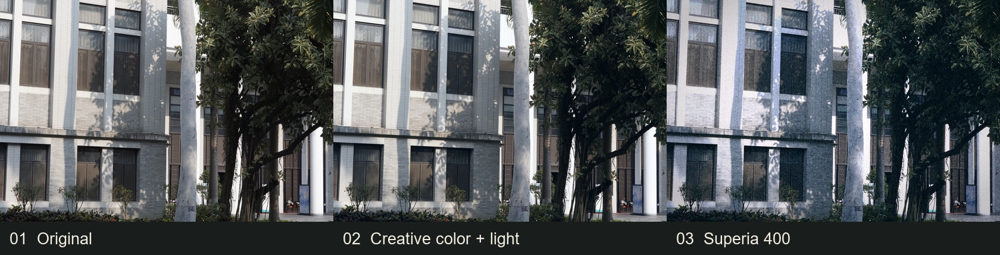
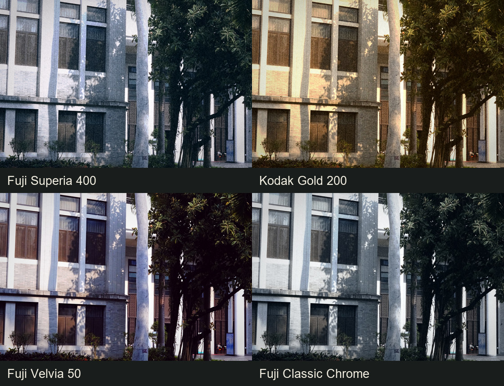

# film-emulation-batch

**先还原色彩，再创作光影，最后形成胶卷风格。** 这个 Codex skill 和本地命令行工具支持批量处理照片：判断 RAW、Log 灰片或普通成片，输出可检查的再创作中间图，再应用富士、柯达、黑白及江南园林电影色预设。全程离线，照片留在本机。

> **English:** An offline photo grading skill and CLI with a three-stage workflow: normalize RAW/Log/standard input, creatively shape color and light, then apply a distinctive film-inspired finish. Includes 19 presets, intermediate exports and reproducible batch rendering.



上图由仓库自带的 [公开样张](samples/sample-building.jpg) 生成。中间图是**胶卷处理的输入**，再经过 Superia 的色彩关系、曲线和颗粒得到右侧成片。其他照片的效果会随光线、曝光和内容变化。

## 三阶段工作流

| 阶段 | 处理目标 | 检查点 |
| --- | --- | --- |
| **1 · 源归一化** | 判断 RAW、可信的 Log 灰片或普通成片。RAW 显影，Log 解码，普通成片直通，得到可继续处理的 sRGB 图。 | 先看判定与置信度，避免把正常成片误当灰片。 |
| **2 · 色彩与光影再创作** | 在已还原的画面上主动塑造冷暖、明暗、局部反差和色度，让主体与情绪明确。输出可作为下一阶段的输入。 | 用 `--save-creative` 保存中间图，检查主体、肤色、纹理及亮部层次。 |
| **3 · 胶卷处理** | 叠加预设曲线、通道色彩交叉、选择性色相、颗粒、光晕及暗角，形成可辨的胶卷风格。 | 同原片和中间图比较全图；放大至 1:1 检查颗粒与高光。 |

第二阶段可以选 `auto`、`warm`、`cool`、`vivid` 或 `soft`。`auto` 根据预设选择方向；`--style-strength 1` 是新的显著版默认值，`0` 可回到旧版基线，`0.6` 适合降低风格强度。`neutral` 是对照组。详见 [再创作阶段的目标与调用规则](docs/creative-stage.md)。

## 同一原片，四种方向



| 方向 | 推荐预设 | 在这张样张上的表现 |
| --- | --- | --- |
| 冷调日常负片 | `superia400` | 冷青阴影、较克制的绿与明亮建筑。 |
| 暖金日常负片 | `gold200` | 暖金阳光、偏橄榄的植物与更明显的颗粒。 |
| 浓艳反转片 | `velvia50` | 更深的阴影、饱和色彩与更强的明暗分离。 |
| 克制纪实 | `classic_chrome` | 降低饱和度，保留冷调与硬朗的暗部。 |

目前共有 **19 个预设**：富士 9 个、柯达 6 个、Ilford HP5 1 个、江南园林参考色 2 个，以及 `neutral` 对照组。用 `--list` 查看完整列表；[预设说明](docs/preset-reference.md)解释参数与适用场景。名称表示风格化参考，并非厂商官方 LUT 或物理乳剂模拟。

## 安装与试跑

需要 Python 3.9+。普通图片安装 `pillow` 和 `numpy`；处理 RAW 再安装 `rawpy`。

```bash
git clone https://github.com/boway033-cell/film-emulation-batch.git
cd film-emulation-batch
python -m pip install pillow numpy
python -m pip install rawpy  # 仅在处理 RAW 时需要

python scripts/film_emulate.py --list
python scripts/film_emulate.py -i samples/sample-building.jpg -p superia400 -o ./out --save-creative
```

上面的命令会写出最终成片，并在 `out/creative-stage/` 写出胶卷处理前的中间图。默认 `--source auto`：先判源，再按三阶段处理。

```bash
# 批量处理；固定种子便于重复生成相同的颗粒
python scripts/film_emulate.py -i ./photos -p gold200 -o ./out --jobs 4 --seed 42

# 同一预设选择再创作方向与强度
python scripts/film_emulate.py -i ./photos -p superia400 -o ./cool --creative-direction cool --style-strength 0.7

# 先生成多预设接触表，再挑选适合照片的方向
python scripts/film_emulate.py --sheet samples/sample-building.jpg -o ./preview --group fuji

# 只查看源格式判定；不写调色图片
python scripts/source_normalize.py ./photos
```

输入可能为灰片时，先核对判定报告。RAW **只显影，不做反 Log**；已正常显影的 JPEG、PNG 等直接进入再创作；只有可信的 Log 判定才解码。若自动判断与已知拍摄格式不符，可用 `--source standard`，或用 `--source log --log-profile s_log3` 显式指定。RAW 可用 `--raw-anchor` 调整显影亮度参照。算法、边界和参数见 [源归一化说明](docs/source-preparation.md)。

## 江南园林参考色与 skill 触发

`jiangnan_cool` 对应园林、旧木、植物、阴天窗景的低饱和冷青绿；`jiangnan_amber` 对应有实际暖光来源的室内或烛光画面。它们来自用户提供的参考剧照的色彩与影调分析，适用照片仍需按内容和光线挑选。[参考图复刻说明](docs/jiangnan-cinema-reference.md)记录了选片理由、风格锚点与微调顺序。

安装为 Codex skill 后，可点名 `$film-emulation-batch`；当任务涉及明显胶片质感、富士/柯达色调、RAW/Log 还原、胶卷前的色彩光影再创作，或江南园林参考色复刻时也可调用。调用规则写在 [SKILL.md](SKILL.md)：**先判源 → 再创作 → 胶卷处理**；参考图只用于提取风格，不作为待处理原片；交付时说明选片理由并展示源图、中间图和成片。`agents/openai.yaml` 提供对应的工具提示信息。

本机安装可把此仓库的文件夹放入 `~/.codex/skills/film-emulation-batch/`。脚本和文档需保持相对目录结构。

## 核验与边界

本仓库提供旧版强度对照（`--style-strength 0`）、源格式判定、风格中间图和接触表，便于逐阶段比较。固定输入、参数和 `--seed` 可重复得到相同输出。新版首页两张演示图仅使用仓库内的公开样张制作；用户的私人照片未加入仓库。

风格预设是对数字照片的**视觉化近似**。胶卷品牌名用于说明取向，不代表厂商背书、官方色彩配置或真实扫描结果。显示器、源照片曝光、白平衡及光线都会影响最终观感；强风格应检查人脸、白墙、高光和暗部是否仍可用。

## 文档与实现

- [SKILL.md](SKILL.md)：触发条件、处理顺序与交付规则。
- [再创作阶段](docs/creative-stage.md)：处理目标、可调方向及作为胶卷输入的要求。
- [源归一化](docs/source-preparation.md)：RAW/Log/普通成片判定与还原。
- [江南园林参考色](docs/jiangnan-cinema-reference.md)：参考图风格复刻与选片。
- [色彩研究](docs/fuji-color-science.md)、[预设说明](docs/preset-reference.md)：视觉参考与参数。
- [film_emulate.py](scripts/film_emulate.py)、[source_normalize.py](scripts/source_normalize.py)：离线处理代码。

## 许可

代码采用 [MIT](LICENSE) 许可；文档与仓库内演示图片采用 CC BY 4.0。演示图片使用已有公开样张制作。
