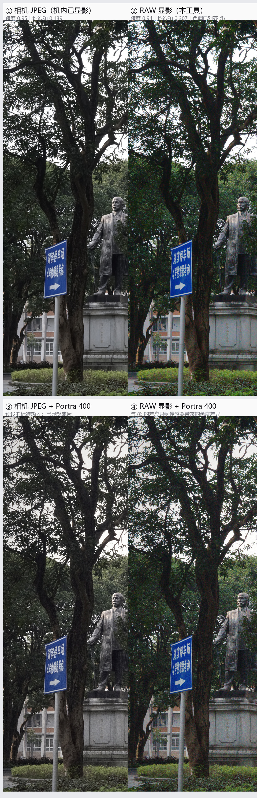
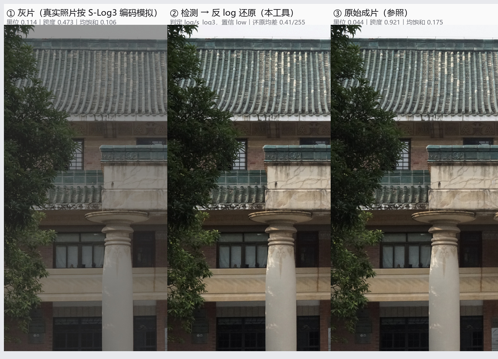

# film-emulation-batch

把一整个目录的照片批量套成胶片风格。**纯本地、离线、零 API、不依赖 Lightroom / Photoshop**，参数全部可读可改，固定种子下结果逐像素可复现。


左：原片（SONY ILCE-6300 实拍，仅摆正方向并缩放到同宽）。右：本项目 `superia400` 预设的输出。**颗粒与光晕在缩略图上看不出来**，1:1 证据见 [`grain-and-tone-1to1.jpg`](images/grain-and-tone-1to1.jpg) 与 [`halation-grading-1to1.jpg`](images/halation-grading-1to1.jpg)。

> EN: Batch film-emulation color grading in pure Pillow + NumPy. 17 presets (Fuji / Kodak / B&W), per-channel curve LUTs, selective hue-band rotation (greens → teal), channel crossover, grain, halation, vignette, acutance, external `.cube` 3D LUT support. **Source normalization first**: RAW gets developed, log/flat footage gets de-logged, normal renders pass through — decided per file, automatically. Deterministic, offline, no API cost.

---

## 这是什么，不是什么

| | |
|---|---|
| **是** | 显示空间里的胶片风格复现：每通道曲线 LUT + 通道色偏（crossover）+ **色相带选择性调整** + 颗粒 + 高光溢出（halation）+ 暗角 + acutance |
| **是** | 17 款预设，全部参数显式写在 `PRESETS` 里，可改、可覆盖、可复现；支持外部 `.cube` 3D LUT |
| **是** | **源归一化前置**：自动判断输入色彩格式 —— RAW 显影成中性 sRGB、灰片/Log 反 log 还原、普通成片（含手机照片）原样通过。判定依据全部来自像素，可复核；有 6 条 log 曲线的官方系数与独立实现交叉核对 |
| **不是** | 物理仿真。没有光谱感光曲线，颗粒也不是乳剂团簇模型（见 [已知局限](#已知局限)） |
| **不是** | AI 重绘或生成。不改画面内容，不"补"不存在的细节，输出像素级可校对 |

**为什么不用 Lightroom 预设**：因为要批量、要可复现、要能读代码里每一行的数值。`--seed 20260926` 固定后，同一张输入两次跑出的文件逐像素一致。

---

## 先判断色彩格式（源归一化）

预设是按「已经正常显影的 sRGB 成片」标定的，所以 RAW 和灰片必须先还原，否则预设建在错误的基准上。
**默认开启**（`--source auto`），不用额外加参数：



上：① 相机 JPEG 与 ② 本工具的 RAW 显影（色调已对齐 ①）；下：③ 相机 JPEG + Portra 400 与 ④ RAW 显影 + Portra 400（两者应接近 —— 预设本来就是按 ③ 这类输入标定的）。

| 输入 | 处理 | 依据 |
|---|---|---|
| **RAW**（ARW/CR2/CR3/NEF/DNG/RAF/ORF/RW2…） | 显影为 sRGB：相机白平衡、不自动提亮、16bit 内部精度；**默认对齐同目录同名成片的中位亮度并叠加其色调形状** | Sony 官方文档：*RAW is sensor native data and RAW does not apply any color space nor log curve* —— 所以 **RAW 只显影，绝不反 log** |
| **灰片 / Log**（S-Log3/S-Log2/V-Log/LogC3/LogC4/Apple Log） | 反 log → 线性反射率 → 中性 sRGB | 基灰指纹 + 场景合理性 + 机厂牌先验，三级判定 |
| 普通成片 / 手机照片 | 原样通过 | 已是成品显影；手机门槛额外抬高一分 |

灰片判定与还原（左：真实照片按 S-Log3 编码的模拟灰片；中：本工具判定并还原；右：原成片）：



六条曲线的官方系数、判定算法、阈值标定过程、实测混淆矩阵与已知边界，全部写在
**[`docs/source-preparation.md`](docs/source-preparation.md)**。核心结论：

* 自检 **46/46 通过**（9 项官方锚点 + 6 条曲线往返相对误差 ~1e-07 + 与 colour-science 0.4.7 交叉核对最大差 <6e-08）
* 判定验收（`scripts/verify/eval_detection.py`，素材是「真实照片的线性源 + 实拍量级噪声 + 6 条曲线编码」，比纯合成场景更接近实拍）：
  * 含纯黑灰片 **24/24** 类型判对、**20/24** 锁进正确曲线（其余 4 张落在同基灰族内，渲染差肉眼不可分）
  * 无纯黑灰片 **24/24** 类型判对（门槛更高的保守分支，置信度多标 `low`）
  * **11 张真实相机成片误报 0** —— 绝不能触发还原
  * 真实 RAW 全部判为 `raw` 走显影分支
* RAW 显影的默认锚定（`reference-tone`）是拿「喂进预设后像不像预设该有的样子」选的：与「相机 JPEG + 同一预设」的均差 **12.8–19.6/255**，而只对齐亮度的 `reference` 是 23.3–29.5、按分位的 `auto` 是 27.5–33.6
* **S-Log3 / LogC3 / LogC4 的基灰完全相同**（都是 95/1023），但同一张图画面的渲染结果平均差可达 **68/255** —— 所以基灰只能定位「族」，族内必须靠机厂牌与场景先验，差异可见时置信度只标 `medium`，不假装确定
* 画面没有纯黑时曲线属**推断**，置信度标 `low` 并明示；`--source log --log-profile <名>` 可强制

```bash
# 只判断、不写图：先把「这批文件到底是什么色彩格式」看清楚
python scripts/source_normalize.py ./photos

# 直接对 RAW 批量套预设（自动显影）
python scripts/film_emulate.py -i ./raw -p portra400 --jobs 6 --prep-json prep.json

# 报错？自检曲线实现
python scripts/source_normalize.py --selftest --crosscheck
```

---

## 快速开始

```bash
git clone https://github.com/boway033-cell/film-emulation-batch.git
cd film-emulation-batch
pip install pillow numpy

# 1) 看有哪些预设
python scripts/film_emulate.py --list

# 2) 先出一张对比图，再决定跑哪个预设
python scripts/film_emulate.py --sheet samples/sample-building.jpg -o ./preview --group fuji --max-edge 1050

# 3) 批量跑一个目录
python scripts/film_emulate.py -i ./photos -p superia400 -o ./out --jobs 6

# 4) 一次跑完整个家族（输出到 <out>/<preset>/）
python scripts/film_emulate.py -i ./photos --group fuji -o ./out --jobs 6

# 5) 单张微调，不改预设文件
python scripts/film_emulate.py -i a.jpg -p superia400 --grain 1.6 --halation 0.6 --vignette 0 --exposure 0.3 \
        --temp -0.2 --tint 0.1 --acutance 0.2

# 6) 套外部 3D LUT（与预设曲线叠加）
python scripts/film_emulate.py -i ./photos -p neutral --lut ./LUTs/Kodak2383.cube --lut-strength 0.8
```

**实测**：24MP 输入、6 进程，单张约 12s；39 张连拍 Portra 400 全批 76.5s，Superia 400 138.7s（预设越复杂越慢）。CPU-only，不需要显卡。

---

## 预设一览（17 款）


### 富士 FUJI（`--group fuji`）

| 预设 | 风格 | 适合 |
|---|---|---|
| `superia400` | 深阴影偏青绿、高光偏品红、绿→青绿、黄被压、白点偏冷 | 万能：街拍、植物、夜景 |
| `classic_neg` | 暗部硬调、明暗区色调分离、高光转暖、饱和被抑制 | 纪实、速写感 |
| `c200` | 冷而准、不变黄 | 日光日常 |
| `pro400h` | 高光极软不爆、暗部永不真黑、粉彩通透、绿更密更冷 | 白墙建筑、人像 |
| `velvia50` | 极饱和反差、绿如祖母绿、开敞阴影品红、高光易爆 | 风光、秋叶、蓝天 |
| `provia100f` | 中性准确、略偏冷、绿忠实 | 要准确、要干净 |
| `classic_chrome` | 低饱和、暗部硬调偏青蓝、高光冷静 | 冷调纪实 |
| `eterna` | 饱和度压到最低、过渡极柔、高光几乎不爆 | 电影感、高动态 |
| `acros` | 黑白：颗粒极细、暗部细节多、锐度高、微冷 | 黑白纪实 |

### 柯达 / 依尔福（`--group kodak`）

| 预设 | 风格 | 适合 |
|---|---|---|
| `portra400` | 中性偏暖、低对比、高光柔和 | 通用首选 |
| `gold200` | 金黄暖调、绿偏黄橄榄、黄红更饱和 | 怀旧日常 |
| `ektar100` | 高饱和、高对比、极细颗粒 | 建筑、风光 |
| `kodachrome` | 浓郁红黄、暗部深 | 复古国家地理 |
| `cinestill800t` | 钨丝灯片日光下强青蓝、高光强红色光晕 | 夜景、霓虹 |
| `tri_x` / `hp5` | 黑白（柯达硬调 / 依尔福中性） | 纪实黑白 |
| `neutral` | 仅抬黑 + 极轻颗粒 | 对照组，量化改动量 |

逐款的完整参数（反差 / 暗部硬度 / 高光滚降 / 黑白位 / 饱和三档 / 白平衡 / 色相带 / 颗粒 / 光晕 / 锐度 / 暗角 / 通道交叉）见 **[docs/preset-reference.md](docs/preset-reference.md)**。

---

## 核心：富士的青绿、高光与暗部

这一节的完整版（逐款性格、资料来源、现象→参数映射、实测数字）在 **[docs/fuji-color-science.md](docs/fuji-color-science.md)**。


**富士与柯达真正的三处分岔**，每一处都能落到参数上：

| 分岔点 | 富士 | 柯达 | 参数落点 |
|---|---|---|---|
| 绿色往哪偏 | 青绿 / teal | 黄橄榄 | `hue_bands.green.hue`（正=青，负=黄） |
| 白点与高光 | 干净不带黄，高光偏品红 | 真正 clip 之前就先转琥珀金 | `temp`、`crossover.highlight`、`sat_hi` |
| 反差曲线形状 | 更紧：高光更早到顶、暗部反差更大 | 更宽：高光肩部长、暗部有"体量" | `shoulder` / `shoulder_k` / `shadow_contrast` |

上图的**面板 ②** 把每个预设的"阴影偏色"与"高光偏色"画成 (R−G, B−G) 平面上的箭头：

- **富士向左上走** —— 青绿阴影 → 品红高光
- **柯达向右下走** —— 琥珀阴影 → 暖金高光

这是两家色彩科学最本质的差别。**高光与暗部的复现清单**：

| 现象 | 参数 |
|---|---|
| 高光偏品红（Superia / C200） | `crossover.highlight = [+0.014, −0.005, +0.011]` |
| 高光褪色更狠、白点干净 | `sat_hi 0.86`（Superia）／`0.78`（Pro 400H） |
| 高光极软不爆（Pro 400H） | `shoulder 0.55` + `shoulder_k 1.2`（很早、很柔的滚降） |
| 高光晚到顶、容易爆（Velvia 50） | `shoulder 0.90` + `shoulder_k 5.0`（很晚、很陡的滚降） |
| 高光冷静不转暖（Classic Chrome） | `crossover.highlight = [−0.004, +0.002, +0.004]` |
| 阴影偏青绿 | `crossover.shadow = [−0.006, +0.011, +0.016]` |
| 阴影深且有密度 | `shadow_contrast 0.20`（Superia）／`0.34`（經典 Neg.、Classic Chrome） |
| 负片不把黑压死 | `toe 0.12`（Superia）／`0.40`（Pro 400H） |
| 阴影永不真黑 | `lift 0.022–0.026` + `toe 0.36–0.40` |
| 开敞阴影品红 cast（Velvia） | `crossover.shadow = [+0.012, −0.006, +0.010]` |

**"青绿色"是逐通道曲线做不到的**——曲线只能改亮度和对比，改不了色相。所以引擎里补了一层 Rec.601 Y/Cb/Cr 对偶空间下的**色相带选择性调整**：色带按单位方向的余弦相似度取权重（免 `atan2`），再做一阶近似的旋转。实测树叶绿 205.5° → 211.8°（**+6.3°**，向青绿），柯达 Gold 反向 −3.6°，中性灰偏移 **0.000000**，空色带严格恒等。

---

## 展示与校样

**全预设对比（缩略图，用来看整体倾向）**

| 建筑（横构图） | 竖构图 |
|---|---|
| [](images/preset-comparison-architecture.jpg) | [](images/preset-comparison-vertical.jpg) |

**九款富士并排**：[`images/fuji-presets-architecture.jpg`](images/fuji-presets-architecture.jpg)

**1:1 像素级校样（判断颗粒、光晕、暗部硬度的唯一依据）**

| 颗粒与色调（9 个预设同区裁切） | 光晕分级（0 / 0.30 / 0.90 / Cinestill 大红晕） |
|---|---|
| [](images/grain-and-tone-1to1.jpg) | [](images/halation-grading-1to1.jpg) |

**富士 vs 柯达 1:1**：[`images/fuji-vs-kodak-1to1.jpg`](images/fuji-vs-kodak-1to1.jpg) —— 同一裁切区，看绿往哪边跑、阴影往哪边偏。

缩略图上无法判断的事：颗粒粗细与团簇、光晕半径、暗部是否真黑、色相偏移几个度。**必须 1:1 裁切复核**，这是本项目所有预设调整流程的硬规定。

---

## 仓库结构

```
film-emulation-batch/
├── README.md                          本文件
├── SKILL.md                           作为 WorkBuddy / Claude Code skill 使用时的说明（触发词、参数、踩坑清单）
├── scripts/
│   ├── film_emulate.py                引擎与 CLI（单文件，仅依赖 Pillow + numpy）
│   ├── source_normalize.py            源归一化：判断色彩格式 + RAW 显影 + 反 log（RAW 需 rawpy）
│   └── verify/                        校验脚本，全部支持 argparse 风格的 argv 传参
│       ├── eval_detection.py          源判定验收（四组面板：含纯黑灰片 / 无纯黑灰片 / 真实成片 / 真实 RAW）
│       ├── check.py                   光晕阈值触发率 + `.cube` 往返正确性（identity 与红蓝互换两个夹具）
│       ├── check_hue.py               色相带：绿是否向青、灰是否完全不动、空带是否严格恒等
│       ├── chart_panels.py            四联图：色调曲线 / 色彩交叉矢量 / 饱和-亮度 / 色相带偏移
│       ├── verify_crop.py             全预设 1:1 裁切校样（高光区 + 阴影区）
│       ├── verify_fuji.py             富士 vs 柯达 1:1 校样（自动定位绿色最密集窗口）
│       ├── verify_halation.py         光晕强度分级 1:1 校样
│       └── verify_batch.py            批量输出校验（数量 / 尺寸 / EXIF 方向 / 平均改动量 / 体积）
├── docs/
│   ├── source-preparation.md          源归一化：判定算法、6 条曲线出处、阈值标定过程、已知边界
│   ├── fuji-color-science.md          富士色彩科学：逐款性格、资料来源、现象→参数映射、已知局限
│   └── preset-reference.md            17 款预设的完整参数表 + CLI 参数说明
├── images/                            本文档引用的全部图（对比图、1:1 校样、曲线对照图）
└── samples/
    └── sample-building.jpg            样例输入（1600px，已剥离 EXIF），可直接跑上面所有命令
```

---

## 管线与校验

`**源归一化**（RAW 显影 / 反 log → 中性 sRGB）→ 白平衡/曝光 → 每通道曲线 LUT（含暗部硬度）→ 通道色偏 crossover → 色相带调整 → 黑白混合/外部 3D LUT → acutance → 饱和度分档 → 高光溢出 → 颗粒 → 暗角 → sRGB`

改任何预设后，按这五步验收：

```bash
S=scripts/film_emulate.py
# 1) 整体倾向
python $S --sheet samples/sample-building.jpg -o ./preview --group fuji --max-edge 1050
# 2) 色相与灰阶不变性（数字断言）
python scripts/verify/check_hue.py
# 3) 1:1 颗粒 / 光晕 / 暗部（唯一可信的视觉验收）
python scripts/verify/verify_crop.py samples/sample-building.jpg ./verify_out
python scripts/verify/verify_halation.py samples/sample-building.jpg ./verify_out
# 4) 批量输出是否摆正、改动量是否合理
python scripts/verify/verify_batch.py . ./out
# 5) 源归一化：曲线实现自检 + 判定规则验收
python scripts/source_normalize.py --selftest --crosscheck
python scripts/verify/eval_detection.py <你的成片目录> [--raw-dir <RAW 目录>]
```

`verify_batch.py` 会打印每张的平均 `|Δ|`。Portra 400 跑这批建筑照是 4.5–6.4 / 255，Superia 400 是 6.6–9.3 / 255 —— **超过 10 就要怀疑是不是过调了**。

---

## 已知局限

**调色侧**

1. **不是物理仿真**。真实底片的青层/品红层响应是波长函数，这里只是显示空间的色彩交叉。做"风格复现"够用，做"某卷胶片在某光源下的精确还原"不够。
2. **色相带是宽环带**，分不清"花黄"与"土黄"，也不能对同一色带内的不同材质分别处理。
3. **颗粒是高斯噪声按亮度调制**，不是乳剂团簇结构 —— 放大到 200% 看，缺少那种"结块"的不规则感。`size` 只能调粗细。
4. **反转片的局部饱和度突变**（Velvia 对红/绿/蓝的强推）用宽环带近似，边缘会有轻微溢色。
5. **没做扫描仪的贡献**。真实"富士感"有很大一部分来自扫描与校色环节，这里直接从 sRGB 数码原片出发。
6. 带颗粒的输出体积比原片大 20–40%（颗粒是高频信号，且用 4:4:4 + 质量 96）。嫌大就 `--quality 92`。

**源归一化侧**（详见 [`docs/source-preparation.md`](docs/source-preparation.md) §5）

7. **单张 8bit 图无法在数学上区分「log 编码的暗场景」与「正常显影但扁平的照片」**。这是问题本质，不是实现缺陷 —— 所以判定只承诺「扁平与否」的二值判断，以及**有硬证据时才锁定具体曲线**。
8. **画面没有纯黑时曲线属推断** —— 中灰先验在雾天 / 夜景 / 高调棚拍会失准，置信度标 `low`，可用 `--source log` 强制。
9. **同基灰族内曲线会互换**（S-Log3 / LogC3 / LogC4 基灰完全相同）。基灰确认时靠残差排序，未确认时只能靠场景中灰先验；凡涉及族内推断，置信度一律 `medium` 或 `low`，渲染差异肉眼可见时会显式提示备选曲线与渲染均差。
10. **Log 且高光已触顶的画面会被保守跳过** —— 宁可少还原一步，也不把正常照片改坏。11 张真实相机成片的误报为 0，代价就是这种保守。
11. **Canon Log 未收录**：两处公开实现（v1 / v1.2）都不能同时复现 Canon 官方表格五点数值，宁可不做也不放错曲线进来。
12. **HEIC / HEIF 不支持**（需 `pillow-heif`），会被标为 `unsupported` 并提示，不会静默跳过。
13. **不做色彩空间转换**：只处理编码曲线，不做 S-Gamut / V-Gamut / BT.2020 → sRGB 的矩阵转换。

---

## 素材与许可

- `samples/` 与 `images/` 中的照片为作者本人实拍（SONY ILCE-6300），已**剥离全部 EXIF**（原片 15 个标签、无 GPS），不包含任何位置信息。
- 代码：MIT（见 [LICENSE](LICENSE)）。
- 文档与图片：CC BY 4.0。
